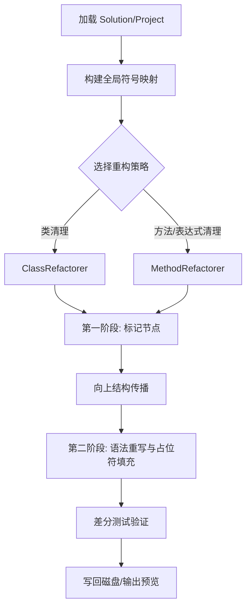

# 项目架构设计 (ARCHITECTURE)

本文档旨在深入描述 TerrariaTools 的内部架构、设计模式以及各核心组件的协作方式。

## **1. 总体设计理念**

TerrariaTools 是一个基于 **Roslyn (Microsoft.CodeAnalysis)** 的高度自动化代码重构引擎。其核心设计目标是：
- **语义驱动**: 所有的重构决策都基于深度的语义分析，而非简单的文本或正则表达式。
- **结构完整性**: 确保重构后的代码始终可编译，并尽可能保持原始的代码风格。
- **可扩展性**: 提供底层的标记与重写框架，方便开发者快速构建自定义的重构规则。

## **2. 核心组件架构**

项目主要由以下几个核心模块组成：

### **2.1. 加载与环境 (Load)**
- **职责**: 负责 MSBuild 环境的初始化、解决方案 (`.sln`) 和项目 (`.csproj`) 的加载。
- **关键技术**: `Microsoft.CodeAnalysis.MSBuild.MSBuildWorkspace`。
- **功能**: 管理 `SemanticModel` 的生命周期，并提供跨项目的符号查找能力。

### **2.2. 重写引擎 (RewriteCodeExpressions)**
这是项目的核心，采用 **两阶段重写模式 (Two-Stage Rewriting)**：

1.  **标记阶段 (Marking Phase)**:
    - 使用 `CollectNodesToMark` 算法，从种子节点开始，利用语义模型追踪所有直接和间接的影响点。
    - **结构传播 (Structural Propagation)**: 通过 `UpwardMarkCollector` 自动向上标记受影响的父节点（例如：如果 `if` 块的所有内容都被删除，则标记整个 `if` 块）。
2.  **执行阶段 (Rewriting Phase)**:
    - `ExpressionSimplifier`: 继承自 `CSharpSyntaxRewriter`，负责执行最终的树变换。
    - **智能占位符**: 当删除的代码在语法上必须有返回值时（如 switch 分支或变量初始化），自动生成类型匹配的默认值（`0`, `false`, `null` 等）。

### **2.3. 高层重构工具 (Refactorers)**
- **ClassRefactorer**: 专注于类级别的清理，包括移除未引用的类及其关联的元数据。
- **MethodRefactorer**: 专注于方法级别的优化。除了移除死代码，还包含 **自动私有化 (Privatization)** 逻辑：将仅在当前类内部使用的 `public` 方法降级为 `private`。

### **2.4. 行为保证 (ConsistentBehaviorGuarantee)**
- **DifferentialTester**: 提供差分测试能力，通过对比重构前后的执行路径和输出来验证语义一致性。
- **Tracing**: 详细记录重构过程中的每一个决策点，方便回溯和调试。

## **3. 核心流程图**

## **4. 设计模式应用**

- **访问者模式 (Visitor Pattern)**: 广泛应用于 `ExpressionSimplifier` 和各类语法树遍历中。
- **策略模式 (Strategy Pattern)**: 允许在重构过程中动态选择不同的 `StructuralPropagation` 策略。
- **不可变性 (Immutability)**: 严格遵循 Roslyn 语法树的不可变原则，确保并发处理时的线程安全。

## **5. 性能考虑**

- **并行处理**: 利用 `Task.WhenAll` 和 `ConcurrentDictionary` 在多核环境下并行分析不同文档。
- **按需加载**: 语义模型和语法树在处理完成后会及时释放，以控制大型项目中的内存消耗。
