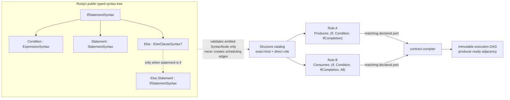

# Structural Rule Contract DAG Implementation Plan

> **For Claude:** REQUIRED SUB-SKILL: Use `executing-plans` to implement this plan task-by-task.

**Goal:** Replace rule-ID and `RuleOutputKind`-driven graph wiring with explicit `Consumes`/`Produces` structural contracts, and validate every marked syntax node against a small Roslyn-backed structure catalog.

**Architecture:** A rule declares the marked structures it consumes and produces. Those declarations are the source of truth for data dependencies; initialization validates them and materializes the immutable execution adjacency, without guessing dependencies from arbitrary AST ancestry or rule-ID prefixes. A structure catalog wraps selected public Roslyn node shapes such as `IfStatementSyntax`, preserves references to the existing syntax tree, and validates structure roles, optional members, and semantic tags.

**Tech Stack:** .NET 10, Microsoft.CodeAnalysis.CSharp, xUnit, current `NLISSN.Core` RuleGraph runtime, and existing `NLCPGStructureView` services.

---

## Status and decision record

The Rule DAG scope of this plan is complete. The Roslyn `if`, variable-declarator, logical-binary, and rewrite-host catalog entries; marked-structure contract model; contract-edge compiler; selector-indexed runtime ports; and the atomic-rule `IfCompletion -> proposal` slice are implemented. The local-definition-to-local-reference, logical-host-to-proposal, and expression/statement-host-to-switch-lift slices now also compile from explicit contracts. Default and control proposals declare terminal domain facts, and expression-host / if-structure lifts declare their Mark-and-Propagate domain inputs. The compatibility stage engines preserve structure ports instead of collapsing them to `RuleOutputKind`.

`RuleGraphDependencyCatalog` has been removed. The compiled graph now receives default-family edges from explicit structural or terminal-fact contracts, never from RuleId family lists.

### Latest execution evidence

- `dotnet test .\\tests\\RoslynDeletionPrototype.HostTests\\RoslynDeletionPrototype.HostTests.csproj --no-restore -p:UseSharedCompilation=false` passed 496/496 on 2026-07-29, including the default-rule contract regression.
- `RuleStructureContractTests`, `RuleGraphCompilerTests`, and `PipelineComponentTests` passed 132/132 on 2026-07-29.
- `Analyze_WithDefaultRuleGraph_DopOneAndSixteenProduceEquivalentResults` passed on 2026-07-29, comparing ordered stage snapshots, decisions, rewritten source, diff, and graph telemetry.
- Sequential builds of `NLISSN.Core`, `NLISSN.Rules`, `NLISSN.Application`, and `NLISSN` passed with 0 warnings and 0 errors on 2026-07-29. One initial Rules build hit an external `NLCPG.sourcelink.json` file lock from concurrent MSBuild activity; the unchanged retry passed.
- `rg -n 'RuleGraphDependencyCatalog|EnableRuleGraphExecution|AllowedAnchorKinds' src tests` returned no references. `git diff --check` and `pwsh -File .\scripts\check-harness-consistency.ps1 -SkipCliSmoke` passed on 2026-07-29.
- `LayoutArchitectureTests` remains blocked by an unrelated current-worktree mismatch: the test expects `NLISSN.Core` not to reference `NL.Caching`, while the checked-in project now does. Rebuilding ContractTests confirmed the same failure; it is not a Rule DAG regression.

### Scheduling boundary

`ApplicationService` compiles the `RulePipeline` once and submits that compiled graph once
through `RuleGraphAnalysisExecutor`; the production path does not call the stage-level
`MarkingEngine.Run`, `PropagationEngine.Run`, `MarkLiftingEngine.Run`, or
`RuleDecisionEngine.Decide` compatibility entry points. Those entry points are invoked only
by isolated component tests, where each test deliberately creates a separate analysis
invocation. They are not nested beneath a production graph execution and therefore cannot
create a second DAG for one production analysis. The regression
`Analyze_WithDefaultPipeline_UsesOneDependencyGraphSubmission` counts the production
submission directly.

### Design decisions

1. A rule owns its complete `Consumes` and `Produces` declarations. `RuleGraphDependencyCatalog` must not append hidden edges by `RuleId` prefix or family name.
2. `Consumes`/`Produces` define the data dependency relationship. Graph compilation validates and materializes that declared relationship into producer-to-consumer adjacency; it does not infer semantic edges merely because two rules inspect compatible `SyntaxKind` values.
3. A marked structure contains both a syntax structure identity and a semantic tag. `SyntaxNode` shape alone is insufficient: the same `IdentifierNameSyntax` can represent several rule-relevant meanings.
4. `AllowedMarkNodeKinds`, `AllowedPropagateNodeKinds`, and `AllowedLiftNodeKinds` evolve into catalog-backed output checks. Do not introduce an independent `AllowedAnchorKinds`; a mark's existing `SyntaxNode` is its sole syntactic location.
5. The catalog covers only structures consumed by rules. It does not recreate Roslyn's full grammar, clone syntax trees, use reflection, or replace semantic analysis.
6. `Mark`, `Propagate`, `Lift`, `Propose`, and final decision resolution have separate contracts. A recursive propagation closure is not silently modeled as a DAG; it requires a later, explicit fixed-point region design.

## Baseline defects this plan addressed

- `RuleGraphNode` still retains `ProducedOutputs` and producer-ID `Dependencies` as a migration envelope, but default rules now declare no legacy dependencies. The default graph test requires every compiled edge to carry a structure selector or terminal fact selector.
- The former `RuleGraphDependencyCatalog` injected dependencies from hard-coded IDs and family lists. It has been removed; no source reference remains.
- `MarkRecord` retains nullable `RuleOutputKind` for stage provenance compatibility. Structural routing uses the distinct `RuleSemanticTag` and catalog selector, so stage envelope and semantic fact are no longer the same dependency key.
- Stage-level compatibility engines remain available to isolated component tests. The production path schedules only the single graph compiled by `RulePipeline`, and the submission-count regression guards that boundary.
- Roslyn exposes immutable, parent-linked, strongly typed syntax nodes. `IfStatementSyntax` exposes its condition, statement, and optional else clause; an `else if` is represented by an `ElseClauseSyntax` whose statement is another `IfStatementSyntax`. See [Work with syntax](https://learn.microsoft.com/en-us/dotnet/csharp/roslyn-sdk/work-with-syntax).

## Target model

```text
Rule
  Consumes: marked structure selectors
    - input structure kind / member role
    - accepted SyntaxNode type or SyntaxKind set
    - semantic tag
    - required, optional, or all-matching cardinality
  Produces: marked structure descriptors
    - output structure kind / member role
    - permitted SyntaxNode type or SyntaxKind set
    - semantic tag

Structure catalog
  - Roslyn root node type
  - named direct members
  - member cardinality and optionality
  - derived relations such as ElseClause.Statement -> ElseIf

CompiledRuleGraph
  - verified contract edges
  - stable node order
  - port-aware diagnostic view
  - producer-level ready adjacency for scheduling
```



The syntax catalog answers only “does this exact Roslyn node satisfy the declared structure role?” The contract compiler answers only “which declared producer ports satisfy this declared consumer port?” These are intentionally separate operations.

### First catalog vertical slice: if structures

| Structure | Roslyn representation | Required members | Optional / derived members |
| --- | --- | --- | --- |
| `IfStructure` | `IfStatementSyntax` | `Condition: ExpressionSyntax`, `Statement: StatementSyntax` | `Else: ElseClauseSyntax?` |
| `IfCondition` | `IfStatementSyntax.Condition` | parent `IfStatementSyntax` | none |
| `IfThenBranch` | `IfStatementSyntax.Statement` | parent `IfStatementSyntax` | none |
| `IfElseBranch` | `IfStatementSyntax.Else` | parent `IfStatementSyntax` | absent when no else exists |
| `ElseIfStructure` | `IfStatementSyntax` | reached only when `ElseClauseSyntax.Statement` is an `IfStatementSyntax` | none |

`IfCondition` must be represented by the typed `ExpressionSyntax` slot rather than a large handwritten set of expression `SyntaxKind` values. A structure relation is valid only at the declared direct slot; descendant containment alone is insufficient.

### Dependency materialization

For every consumer contract, graph compilation finds declared producer contracts with the same semantic tag and compatible structure selector. This is deterministic contract compilation, not AST-based inference.

- `All`: every compatible producer becomes an input and a ready prerequisite.
- `ExactlyOne`: initialization fails for zero or multiple compatible producers.
- `Optional`: zero producer is allowed; the executor supplies an empty input with an explicit availability state.
- `Any` is excluded from this phase because it needs a first-completion or first-nonempty policy and changes deterministic execution semantics.

An output selector must be a subset of its consumer's accepted syntax structure selector. Partial overlap is a contract error; split the output into separate descriptors instead of silently filtering values.

## Scope

### Included

- Contract models for marked structures and their cardinality.
- A small, public-Roslyn-backed structure catalog, beginning with `if` / `else if` structures.
- Static initialization checks for contract closure, selector compatibility, cardinality, and cycles.
- A compiled graph whose edges originate exclusively from rule contracts.
- Migration of the default atomic-rule pipeline after the vertical slice proves equivalence.
- Tests for catalog shape, contract diagnostics, disabled producer behavior, and DOP-equivalent results.

### Excluded

- A complete wrapper for every C# grammar production.
- Replacement of `SemanticModel`, symbol binding, CPG facts, or data-flow analysis with syntax-tree relations.
- A fixed-point execution engine for recursive propagation.
- Changes to default DOP, CPG build admission, directory parallelism, rewrite policy, or decision conflict semantics.
- Deleting legacy fields before all default rules and compatibility entry points use the new contracts.

## Invariants

1. Rules do not name a hidden producer through a catalog or a `RuleId` convention.
2. Every consumed marked structure has a valid semantic tag, valid syntax structure selector, and declared producer set under its cardinality policy.
3. Every emitted `MarkRecord`, `PropagatedMarkRecord.Mark`, or `LiftedMarkRecord.Mark` resolves to the structure and tag declared by its producer rule.
4. A disabled producer stays visible in the compiled graph. Its output availability is distinct from a completed producer that produced no values.
5. The compiled DAG is deterministic for a fixed rule registry; DOP 1 and DOP 16 preserve all rule, mark, decision, rewrite-source, and diff snapshots.
6. `IfStatementSyntax` with no `Else` and malformed/incomplete syntax never produces a fabricated else structure.
7. `DecisionUnit` remains outside the marked-syntax catalog and receives its own terminal contract in the Decision stage.

## Implementation tasks

### Task 1: Lock the catalog and contract behavior with focused tests

**Files:**

- Create: `tests/RoslynDeletionPrototype.HostTests/Application/RuleStructureContractTests.cs`
- Modify: `tests/RoslynDeletionPrototype.HostTests/Application/RuleGraphCompilerTests.cs`
- Read: `src/NLISSN.Core/Marking/MarkRecord.cs`
- Read: `src/NLISSN.Core/Pipeline/RuleGraph.cs`

**Step 1: Write failing catalog tests.**

Cover one source containing plain `if`, `if/else`, and `else if`.

- Resolve `IfStructure`, `IfCondition`, and `IfThenBranch` from their direct Roslyn slots.
- Resolve `IfElseBranch` only when `Else` exists.
- Resolve `ElseIfStructure` only through `ElseClause.Statement`.
- Reject an arbitrary descendant expression as an `IfCondition` when it is not the direct condition slot.
- Treat incomplete `if` syntax as a non-throwing failed resolution or an explicitly incomplete structure, whichever catalog policy is selected in Task 2.

**Step 2: Run the focused tests and confirm they fail.**

```powershell
$env:DOTNET_CLI_HOME = (Resolve-Path '.').Path
dotnet test .\tests\RoslynDeletionPrototype.HostTests\RoslynDeletionPrototype.HostTests.csproj --no-restore --filter FullyQualifiedName~RuleStructureContractTests
```

Expected: compilation failure because the contract and catalog types do not exist.

**Step 3: Write failing graph-contract tests.**

- A consumer requiring `IfCompletion` on `IfCondition` with no compatible producer fails at compile time.
- An `ExactlyOne` consumer with two compatible producers fails with producer IDs in stable order.
- A producer that declares `IfStructure` but emits a condition node fails output validation.
- An `All` consumer receives outputs from all compatible producers in stable graph order.
- A disabled matching producer remains observable as disabled while a completed empty producer remains completed.

**Step 4: Extend existing graph regression tests.**

Add a DOP 1/DOP 16 snapshot comparison using one migrated fixture. Assert seed marks, propagated marks, lifted marks, decisions, rewrite source, and diff are equal. Keep the existing producer-ID tests until Task 5 removes the legacy adapter.

**Step 5: Commit.**

```text
Define expected structural rule-contract behavior before migration

Tested: Focused contract tests intentionally failing
Not-tested: Production implementation
```

### Task 2: Implement the Roslyn-backed structure catalog

**Files:**

- Create: `src/NLISSN.Core/Analysis/Structure/RuleSyntaxStructureCatalog.cs`
- Create: `src/NLISSN.Core/Analysis/Structure/RuleSyntaxStructure.cs`
- Modify: `src/NLISSN.Core/Analysis/View/NLCPGStructureViewBuilder.cs` only if the catalog needs its existing syntax-to-CPG binding service
- Test: `tests/RoslynDeletionPrototype.HostTests/Application/RuleStructureContractTests.cs`

**Step 1: Add immutable structure descriptors.**

Define `RuleSyntaxStructureKind`, `RuleSyntaxStructureRole`, a `RuleSyntaxStructureRef` containing the existing `SyntaxNode`, and a resolution result that distinguishes `Resolved`, `AbsentOptionalMember`, and `IncompleteSyntax`.

**Step 2: Add explicit if-structure resolvers.**

Use pattern matching on `IfStatementSyntax` and typed properties:

```csharp
ifStatement.Condition;
ifStatement.Statement;
ifStatement.Else;
ifStatement.Else?.Statement as IfStatementSyntax;
```

Do not implement this slice with `DescendantNodes()`, reflection, node-name strings, or a full AST copy.

**Step 3: Define catalog validation.**

The catalog must validate a concrete marked node against an exact `(structure kind, role)` pair. It must reject descendant-only matches and must preserve Roslyn's nullable optional-member semantics.

**Step 4: Run Task 1 catalog tests.**

Use the command from Task 1. Expected: catalog cases pass; graph contract cases remain failing until Task 3.

**Step 5: Commit.**

```text
Make selected Roslyn structures available as immutable rule contracts

Constraint: Catalog retains Roslyn nodes instead of rebuilding syntax trees
Tested: If structure catalog cases
Not-tested: Rule graph integration
```

### Task 3: Add `Consumes` and `Produces` marked-structure contracts

**Files:**

- Create: `src/NLISSN.Core/Pipeline/RuleStructureContract.cs`
- Modify: `src/NLISSN.Core/Pipeline/RuleDefinition.cs`
- Modify: `src/NLISSN.Core/Pipeline/RuleGraph.cs`
- Modify: `src/NLISSN.Core/Marking/MarkRecord.cs`
- Test: `tests/RoslynDeletionPrototype.HostTests/Application/RuleStructureContractTests.cs`

**Step 1: Define the contract types.**

Add immutable records for:

- `RuleSemanticTag` — semantic meaning distinct from stage provenance;
- `MarkedStructureSelector` — structure kind, role, accepted node contract, tag, and cardinality;
- `RuleConsumesContract` and `RuleProducesContract` — rule-owned lists of selectors;
- `RuleInputCardinality` — `All`, `ExactlyOne`, and `Optional` only in this phase.

Keep direct-mark, propagated-mark, and lifted-mark provenance on their existing record wrappers. Remove stage envelope values from the semantic contract surface; provide a temporary adapter from existing `RuleOutputKind` during migration.

**Step 2: Extend rule definitions without changing scheduling yet.**

Add `Consumes` and `Produces` to `IRuleDefinition` and each stage base class. For unported rules, use a marked legacy adapter that maps current declarations without consulting `RuleGraphDependencyCatalog` for new rules.

**Step 3: Validate actual outputs at their construction boundary.**

- `MarkingEngine.ExecuteRule` validates each returned `MarkRecord` against its producer's `Produces` contract.
- `PropagationEngine.ExecuteRule` validates `PropagatedMarkRecord.Mark`.
- `MarkLiftingEngine.ExecuteRule` validates `LiftedMarkRecord.Mark`.
- `RuleDecisionEngine` remains outside this validation and continues to validate decision-node constraints separately.

**Step 4: Run focused tests.**

```powershell
dotnet test .\tests\RoslynDeletionPrototype.HostTests\RoslynDeletionPrototype.HostTests.csproj --no-restore --filter "FullyQualifiedName~RuleStructureContractTests|FullyQualifiedName~RuleGraphCompilerTests"
```

Expected: declaration and emitted-node violations fail deterministically; existing legacy graph tests stay green through the adapter.

**Step 5: Commit.**

```text
Describe rule inputs and outputs as checked marked structures

Constraint: Syntax structure and semantic tag remain separate dimensions
Tested: Contract declaration and emitted-node validation
Not-tested: Full default rule migration
```

### Task 4: Compile contract relationships into the sole Rule DAG

**Files:**

- Modify: `src/NLISSN.Core/Pipeline/RulePipeline.cs`
- Modify: `src/NLISSN.Core/Pipeline/RuleGraphCompiler.cs`
- Modify: `src/NLISSN.Core/Pipeline/RuleGraphExecutor.cs`
- Modify: `src/NLISSN.Application/Analysis/RuleGraphAnalysisExecutor.cs`
- Test: `tests/RoslynDeletionPrototype.HostTests/Application/RuleStructureContractTests.cs`
- Test: `tests/RoslynDeletionPrototype.HostTests/Application/RuleGraphCompilerTests.cs`

**Step 1: Compile the explicit contracts.**

Build a contract index from all registered active and disabled rules. Match only declared selectors; do not traverse the AST and do not use prefix-based default dependency injection. Materialize a port-aware diagnostic edge and a producer-deduplicated scheduling edge.

**Step 2: Enforce cardinality and compatibility.**

Reject absent required producers, ambiguous `ExactlyOne` producers, incompatible structure kinds, incompatible semantic tags, and partial node-selector overlap. Preserve deterministic producer ordering in every error message.

**Step 3: Build typed rule inputs.**

Replace stage-local `object` flattening with contract-keyed access. A consumer requests its declared `MarkedStructureSelector`; it cannot read an undeclared producer output. Keep producer status available beside the values.

**Step 4: Keep one scheduling path.**

`RuleGraphAnalysisExecutor` runs the compiled graph. Mark, propagation, lift, and decision engines supply pure rule execution adapters; they do not rebuild result snapshot graphs or reinterpret contract edges.

**Step 5: Run focused tests.**

```powershell
dotnet test .\tests\RoslynDeletionPrototype.HostTests\RoslynDeletionPrototype.HostTests.csproj --no-restore --filter "FullyQualifiedName~RuleStructureContractTests|FullyQualifiedName~RuleGraphCompilerTests|FullyQualifiedName~PipelineComponentTests"
```

Expected: all contract closure, cardinality, disabled-status, port delivery, and single-submission tests pass.

**Step 6: Commit.**

```text
Compile structural rule contracts into the execution DAG

Rejected: AST ancestry based dependency inference | it creates false scheduling edges
Tested: Focused graph and contract tests
Not-tested: Complete default-rule migration
```

### Task 5: Migrate default rules by structural vertical slices and remove hidden wiring

**Files:**

- Modify: `src/NLISSN.Rules/Mark/*.cs`
- Modify: `src/NLISSN.Rules/Propagate/*.cs`
- Modify: `src/NLISSN.Rules/Lift/*.cs`
- Modify: `src/NLISSN.Rules/Propose/*.cs`
- Modify: `src/NLISSN.Core/Pipeline/RuleGraphDependencyCatalog.cs`
- Modify: `tests/RoslynDeletionPrototype.HostTests/Application/PipelineComponentTests.cs`
- Modify: `tests/RoslynDeletionPrototype.HostTests/Application/RuleGraphCompilerTests.cs`

**Step 1: Migrate one vertical slice first.**

Start with the actual `IfCompletion -> IfStructureProposalRule` data edge: current proposals consume `IfStructureCompletionPayload` directly, while `IfStructure` lift feeds the switch-lift chain. Declare the `If.Whole` and `If.ElseBranch` completion outputs and consumer ports with family-specific semantic tags. Before migrating the separate `IfStructure` lift slice, split its structural outputs from its generic fallback marks; do not place both under one broad selector.

**Step 2: Migrate local-definition/reference slices.**

Port `LocalDefinitionFromInitializer`, `LocalDefinitionFromObjectCreation`, and `LocalReference` only after defining whether they are pure syntax structures or require a semantic predicate. Use `SemanticModel` for symbol identity; never claim AST containment proves a reference relation.

**Step 3: Migrate expression and switch host slices.**

Add catalog entries only for actually consumed direct slots and hosts. Each addition requires catalog cases for positive, optional, and invalid descendant paths.

**Step 4: Remove hidden catalog behavior.**

Delete `FamilyFacts`, prefix checks, static rule-ID arrays, and all default dependency injection from `RuleGraphDependencyCatalog` only after no default rule consumes the legacy adapter. Delete the file if no other justified responsibility remains.

**Step 5: Keep compatibility outside production orchestration, then remove it.**

Compatibility entry points may support isolated component-test invocations, but production
orchestration must not call them or create a second DAG beneath the compiled pipeline graph.
Remove them after their component coverage has moved to pipeline-level graph fixtures.

**Step 6: Commit each independently equivalent slice.**

Each commit follows the Lore protocol and records the migrated structure category, preserved snapshots, and any unported semantic relationships.

### Task 6: Full verification, observability, and rollout gate

**Files:**

- Modify: `docs/plans/2026-07-29-structural-rule-contract-dag-execution-proposal.md` only to record completed commands and results
- Modify: `progress.md` and `feature_list.json` only after this proposal is accepted as an active feature

**Step 1: Build sequentially.**

```powershell
$env:DOTNET_CLI_HOME = (Resolve-Path '.').Path
dotnet build .\src\NLISSN.Core\NLISSN.Core.csproj --no-restore -p:UseSharedCompilation=false
dotnet build .\src\NLISSN.Rules\NLISSN.Rules.csproj --no-restore -p:UseSharedCompilation=false
dotnet build .\src\NLISSN.Application\NLISSN.Application.csproj --no-restore -p:UseSharedCompilation=false
dotnet build .\src\NLISSN\NLISSN.csproj --no-restore -p:UseSharedCompilation=false
```

**Step 2: Run contract and pipeline tests sequentially.**

```powershell
dotnet test .\tests\RoslynDeletionPrototype.HostTests\RoslynDeletionPrototype.HostTests.csproj --no-build --filter "FullyQualifiedName~RuleStructureContractTests|FullyQualifiedName~RuleGraphCompilerTests|FullyQualifiedName~PipelineComponentTests"
dotnet test .\tests\RoslynDeletionPrototype.ContractTests\RoslynDeletionPrototype.ContractTests.csproj --no-build --filter FullyQualifiedName~LayoutArchitectureTests
git diff --check
pwsh -File .\scripts\check-harness-consistency.ps1 -SkipCliSmoke
```

Run commands sequentially because projects share the `Build` output tree.

**Step 3: Prove semantic and DOP equivalence.**

For each migrated slice, execute graph DOP 1 and DOP 16 after one warm-up. Compare ordered seed, propagated, lifted, and decision snapshots, rewritten source, and diff. Record wall time, allocations, node count, ready peak, and concurrent peak, but do not claim a performance improvement without a same-input baseline.

**Step 4: Record independent blockers honestly.**

`init.ps1` currently references the removed `src\\MinimalRoslynCpg\\MinimalRoslynCpg.csproj`; `check-harness-consistency.ps1` may reference removed migration paths. Report those harness failures separately from Rule DAG results.

## Completion criteria

- Default rules expose complete `Consumes`/`Produces` structural contracts; no hidden rule-ID dependency catalog remains.
- The catalog validates all migrated marked structures and correctly distinguishes required, optional, derived, and incomplete syntax members.
- The graph compiler reports missing, ambiguous, incompatible, and cyclic contract relationships deterministically.
- One compiled structural DAG is the only rule scheduling source across Mark, Propagate, Lift, Propose, and final decision input collection.
- Disabled, completed-empty, cancelled, and failed producer states remain distinguishable at declared consumer inputs.
- Focused Host and architecture tests, sequential builds, DOP equivalence checks, and `git diff --check` pass, or independent blockers are documented with their exact cause.

## Risks and containment

| Risk | Containment |
| --- | --- |
| A syntax-only selector confuses a semantic relation with structural containment. | Preserve semantic tags and require `SemanticModel` predicates for references, bindings, and removability. |
| A broad selector reconnects unrelated rules. | Use exact structure role plus tag; reject partial selector overlap and ambiguous `ExactlyOne` matches. |
| Recursive propagation introduces a cycle. | Keep this phase DAG-only; design a separate fixed-point region before permitting recursive contracts. |
| Roslyn parser returns incomplete syntax. | Model incomplete and optional members explicitly; never synthesize missing branches. |
| Broad migration changes rewrite behavior. | Migrate one vertical slice at a time and block each slice on direct, persisted, and DOP-equivalent rewrite snapshots. |
