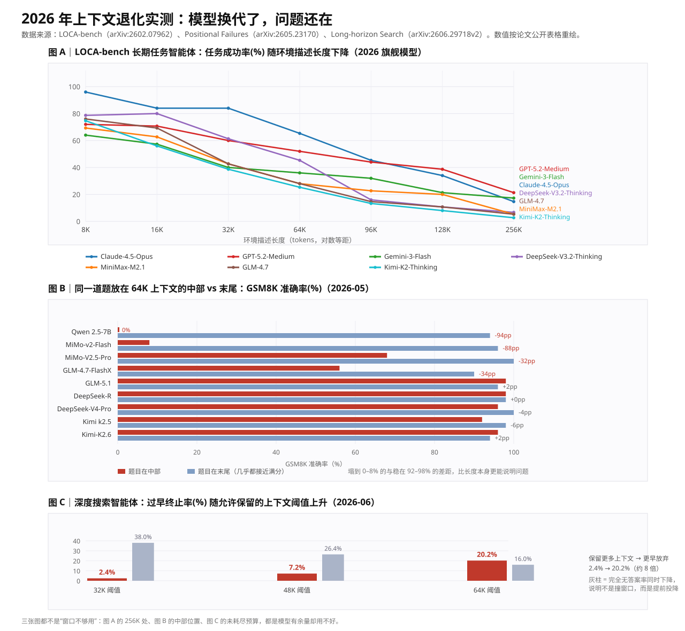
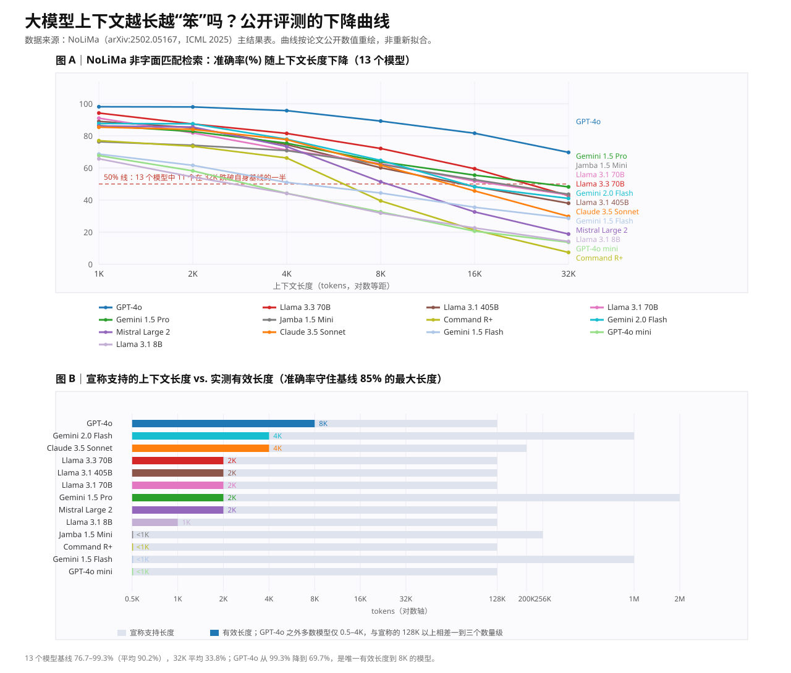

# 大模型上下文长度与能力下降：公开评测证据汇总

- 日期：2026-09-24
- 主题：LLM 上下文变长后能力下降（context rot / long-context degradation）的公开评测结果与图表
- 结论摘要：**"能装进多少 token" 与 "能用好多少 token" 是两件事**。截至 2026-09 的公开评测一致显示，上下文变长会带来与长度本身相关的能力下降，且下降在需要推理、聚合、跨片关联的任务上远比简单检索明显。**2026 年的旗舰模型（GPT-5.2、Claude-4.5-Opus、Gemini-3-Flash、DeepSeek-V4、Kimi-K2.6 等）仍然如此。**

## 1. 可直接查看的下降图

### 1.1 2026 年实测（旗舰模型换代后）

三栏分别对应三类 2026 年新证据：

- **图 A**：LOCA-bench 长期任务智能体的任务成功率 vs. 环境描述长度（Claude-4.5-Opus、GPT-5.2-Medium、Gemini-3-Flash 等 7 个模型）。
- **图 B**：同一道 GSM8K 题放在 64K 上下文中部 vs 末尾的准确率对比。
- **图 C**：深度搜索智能体的"过早终止率"随上下文阈值上升。

矢量源 [`assets/2026-09-24-llm-context-degradation-2026-chart.svg`](assets/2026-09-24-llm-context-degradation-2026-chart.svg)，位图副本 [`assets/2026-09-24-llm-context-degradation-2026-chart.png`](assets/2026-09-24-llm-context-degradation-2026-chart.png)。

**结论：模型换代没有消除这个问题，只是把曲线整体上移了。** 详见 [第 3 节](#3-2026-年一手数据)。

### 1.2 2025 年基准：宣称窗口 vs 有效窗口

图分两栏：

- **图 A**：NoLiMa 主结果表（13 个模型）的非字面匹配检索准确率随上下文长度下降曲线，含 50% 参考线。
- **图 B**：同一批模型"宣称支持长度 vs. 实测有效长度（准确率守住基线 85% 的最大长度）"对比。

图表按论文公开数值重绘，未做拟合或平滑：

- 矢量源：[`assets/2026-09-24-llm-context-degradation-chart.svg`](assets/2026-09-24-llm-context-degradation-chart.svg)
- 位图副本：[`assets/2026-09-24-llm-context-degradation-chart.png`](assets/2026-09-24-llm-context-degradation-chart.png)

本机 PyPI 不可达（`matplotlib` 装不上），因此两张图都由无依赖脚本直接生成 SVG 再用无头浏览器导出 PNG；文字包围盒与画布边界经脚本校验，无重叠、无出界。

## 2. 一手数据：NoLiMa（arXiv:2502.05167，ICML 2025）

任务设计：needle 与 question 之间**几乎没有字面重叠**，必须靠潜在关联（如"住在 Kiasma 博物馆旁边"→"赫尔辛基"）定位 needle，因此无法靠关键词匹配蒙对。

主结果（准确率 %，`Base` 为短上下文基线）：

| 模型 | 宣称长度 | 有效长度 | Base | 1K | 2K | 4K | 8K | 16K | 32K |
| --- | --- | --- | --- | --- | --- | --- | --- | --- | --- |
| GPT-4o | 128K | 8K | 99.3 | 98.1 | 98.0 | 95.7 | 89.2 | 81.6 | 69.7 |
| Llama 3.3 70B | 128K | 2K | 97.3 | 94.2 | 87.4 | 81.5 | 72.1 | 59.5 | 42.7 |
| Llama 3.1 405B | 128K | 2K | 94.7 | 89.0 | 85.0 | 74.5 | 60.1 | 48.4 | 38.0 |
| Llama 3.1 70B | 128K | 2K | 94.5 | 91.0 | 81.8 | 71.2 | 62.7 | 51.8 | 43.2 |
| Gemini 1.5 Pro | 2M | 2K | 92.6 | 86.4 | 82.7 | 75.4 | 63.9 | 55.5 | 48.2 |
| Jamba 1.5 Mini | 256K | <1K | 92.4 | 76.3 | 74.1 | 70.8 | 62.2 | 52.7 | 43.6 |
| Command R+ | 128K | <1K | 90.9 | 77.0 | 73.5 | 66.2 | 39.5 | 21.3 | 7.4 |
| Gemini 2.0 Flash | 1M | 4K | 89.4 | 87.7 | 87.5 | 77.9 | 64.7 | 48.2 | 41.0 |
| Mistral Large 2 | 128K | 2K | 87.9 | 86.1 | 85.5 | 73.3 | 51.4 | 32.6 | 18.8 |
| Claude 3.5 Sonnet | 200K | 4K | 87.5 | 85.4 | 84.0 | 77.6 | 61.7 | 45.7 | 29.8 |
| Gemini 1.5 Flash | 1M | <1K | 84.7 | 68.6 | 61.6 | 51.0 | 44.4 | 35.5 | 28.6 |
| GPT-4o mini | 128K | <1K | 84.8 | 67.7 | 58.2 | 44.2 | 32.6 | 20.6 | 13.7 |
| Llama 3.1 8B | 128K | 1K | 76.7 | 65.7 | 54.4 | 44.1 | 31.9 | 22.6 | 14.2 |

数据来源：[arXiv:2502.05167v3](https://arxiv.org/abs/2502.05167) 主结果表（有效长度定义为准确率保持在基线 85% 以上的最大测试长度；阈值参照 Llama 2 在 4K 的 85.6%）。

可核对的三个事实：

1. 13 个模型中 **11 个在 32K 只剩基线的一半或更少**（基线区间 76.7–99.3%，平均 90.2%；32K 平均 33.8%）。
2. 即便基线接近满分，**有效长度普遍只有 2K**；GPT-4o 是唯一到 8K 的例外。
3. 退化在 **2K–8K 就已可见**，不是等到 128K 才出现。

## 3. 2026 年一手数据

### 3.1 LOCA-bench：长期任务智能体（[arXiv:2602.07962](https://arxiv.org/abs/2602.07962)，2026-02-08，ICML）

任务语义固定，只调节环境描述长度，因此排除了"任务变难"这个混淆因素。任务成功率（%）：

| 模型 | 8K | 16K | 32K | 64K | 96K | 128K | 256K | 平均 |
| --- | --- | --- | --- | --- | --- | --- | --- | --- |
| Claude-4.5-Opus | 96.0 | 84.0 | 84.0 | 65.3 | 45.3 | 34.0 | 14.7 | 68.1 |
| GPT-5.2-Medium | 72.0 | 70.7 | 60.0 | 52.0 | 44.0 | 38.7 | 21.3 | 51.2 |
| Gemini-3-Flash | 64.0 | 57.3 | 40.0 | 36.0 | 32.0 | 21.3 | 17.3 | 38.3 |
| DeepSeek-V3.2-Thinking | 78.7 | 80.0 | 61.3 | 45.3 | 16.0 | 10.7 | 6.7 | 42.7 |
| MiniMax-M2.1 | 69.3 | 62.7 | 42.7 | 28.0 | 22.7 | 20.0 | 5.3 | 35.8 |
| GLM-4.7 | 76.0 | 69.3 | 42.7 | 28.0 | 14.7 | 10.7 | 5.3 | 35.2 |
| Kimi-K2-Thinking | 74.7 | 56.0 | 38.7 | 25.3 | 13.3 | 8.0 | 2.7 | 31.2 |

数据来源：LOCA-bench Table 1（accuracy，即任务成功率）。要点：

1. **最强模型也单调下降**：Claude-4.5-Opus 从 8K 的 96.0% 掉到 256K 的 14.7%，衰减约 6.5 倍。
2. **越强的模型绝对跌幅越大**：Opus 掉 81.3pp，Gemini-3-Flash 只掉 46.7pp——因为弱模型起点就低，天花板效应明显。注意这不等于"强模型更差"，Opus 在各长度档的绝对值仍然最高。
3. **失败模式可归类**：论文给出探索不足、复杂推理退化、指令遵循变弱、幻觉四类具体案例。
4. **上下文工程能显著补偿**：在 128K 设置下，Claude-4.5-Opus 从 34.0% 提升到 49.3%（Anthropic 版 programmatic tool calling）；但同一模型配 Claude Agent 反而降到 26.7%。

### 3.2 Positional Failures：位置比长度更致命（[arXiv:2605.23170](https://arxiv.org/abs/2605.23170)，2026-05-22）

审计 11 个长上下文基准，发现**没有一个同时控制任务位置、填充内容和上下文长度**；四个旗舰模型的发布主表里没有 NIAH、RULER 或 LongBench 系列条目。作者提出 CRE 框架补齐这三者。

GSM8K，64K，`with_solutions` 填充（End = 题目在末尾，Drop = 中部相对末尾的跌幅）：

| 模型 | 末尾 | 中部 | 跌幅 | 显著性 |
| --- | --- | --- | --- | --- |
| Qwen 2.5-7B | 94% | 0% | −94pp | ⋆ |
| MiMo-v2-Flash | 96% | 8% | −88pp | ⋆ |
| GLM-4.7-FlashX | 90% | 56% | −34pp | ⋆ |
| MiMo-V2.5-Pro | 100% | 68% | −32pp | ⋆ |
| DeepSeek-V4-Pro | 100% | 96% | −4pp | |
| Kimi k2.5 | 98% | 92% | −6pp | |
| Kimi-K2.6 | 94% | 96% | +2pp | |
| GLM-5.1 | 96% | 98% | +2pp | |
| DeepSeek-R | 98% | 98% | 0pp | |

中部数值由"末尾 + 跌幅"推得（Table 1）。⋆ 为通过 Bonferroni 校正（α=0.01，27 次比较）的显著下降，共 6/27 显著：Qwen 在三个长度档全显著，MiMo-v2-Flash 在 64K，MiMo-V2.5-Pro 与 GLM-4.7-FlashX 各在 64K。

关键机制证据（8K 诊断探针，N=50）：

- **加一个"任务副本"到末尾就能救回来**：`middle_dup` 布局把九个模型的中部准确率拉回末尾基线的 ±4pp 以内，说明下降是**位置性**的，不是能力不足。
- **填充文本会"抢答"**：初始五模型组中，中部位置的错误有 **76%** 与周围填充文本匹配，末尾位置只有 **22%**。
- **换填充内容，跌幅仍在**：`questions_only_v2` 填充下，四个新模型在 8K/32K/64K 全部为负，范围 −16pp 到 −56pp。
- **新模型确实在改善**：MiMo-v2-Flash 的 88pp 跌幅，在 MiMo-V2.5-Pro 上收窄到 32pp。

### 3.3 过早终止：不是撞窗口，是提前投降（[arXiv:2606.29718v2](https://arxiv.org/abs/2606.29718v2)，2026-06-29）

四个旗舰模型 × 三个深度搜索基准，发现**过早终止（premature termination）**：在远未耗尽上下文窗口时就放弃或给出不确定的错误答案。控制查询难度后，过早终止率与上下文长度正相关。

BrowseComp + Qwen3.5-397B-A17B，`summary (length)` 策略，改变允许保留的上下文阈值（Table 4）：

| 长度阈值 | 工具调用数 | 准确率 | 过早终止率 | 完全无答案率 |
| --- | --- | --- | --- | --- |
| 32K | 57.7±0.9 | 46.6±0.9 | 2.4±1.1 | 38.0±1.0 |
| 48K | 50.6±3.0 | 45.2±5.2 | 7.2±2.6 | 26.4±4.8 |
| 64K | 41.7±2.2 | 45.0±2.9 | **20.2±4.8** | 16.0±2.3 |

保留更多上下文时，过早终止率从 2.4% 升到 20.2%（约 8 倍），工具调用数同步下降（57.7 → 41.7），而完全无答案率同时下降——**说明失败不是窗口耗尽，而是模型主动停止探索**。`discard-all` 策略呈现同一趋势（Table 6：32K 时过早终止率 16.2%，64K 时 41.2%）。

上下文管理本质上是一种降低过早终止率的测试时缩放策略；论文的并行采样 + 行为感知过滤在三类聚合方法上带来 2.6%–4.9% 的收益。

### 3.4 其他 2026 年证据

| 来源 | 观察 | 关键数字 |
| --- | --- | --- |
| Context Rot in Coding Agents（[arXiv:2607.17937](https://arxiv.org/abs/2607.17937)，2026-07-20） | 生产代码审计工作流，任务与 24 项检查固定，只变周围上下文 | 干净上下文 8/10 通过；等长相关与无关长上下文都只有 3/10（−50pp，Fisher p=0.0698）；但另一任务在两种长度下全通过，不支持"普适长度阈值" |
| Context Length Alone Hurts（[arXiv:2603.22608](https://arxiv.org/abs/2603.22608)，2026-03-20） | 多实例处理（MIP）：对 LLM 单独擅长的任务做批量聚合 | 约 20–100 个实例开始轻微退化，之后性能坍塌；**实例数的影响比上下文长度更强** |
| Classifier Context Rot（[arXiv:2605.12366](https://arxiv.org/abs/2605.12366)，2026-05-12） | 模型充当"危险行为监控分类器" | Opus 4.6 / GPT 5.4 / Gemini 3.1 在 800K 良性活动后漏检危险动作的概率高 **2–30 倍**；周期提醒可部分缓解 |
| Agentic Context Management（[arXiv:2607.21503](https://arxiv.org/abs/2607.21503)，2026-07-23） | 把上下文管理形式化为五原语（架构、摄取、定域、预判、压实），给出成本论证 | 朴素累积 token 成本随对话长度平方增长；粗暴摘要降为线性但换来"准确率悬崖"；仅经校验的压实能兼顾 |
| Repo-level Code QA（[arXiv:2608.01507](https://arxiv.org/abs/2608.01507)，2026-08-02） | 对比语义检索 vs. 子代理隔离上下文的 grep 搜索 | 语义检索 65.2% vs. 46.2%，且成本不到一半；子代理方案最大失败来源（41.8%）是规划者与子代理的交接，且多为"流畅而自信的错误答案" |
| Config-file Context Rot（[arXiv:2606.09090](https://arxiv.org/abs/2606.09090)，2026-06-08） | `CLAUDE.md`、`AGENTS.md`、`.cursorrules` 等配置随代码演进变陈旧 | 356 个代表性仓库中 23.0% 存在过期代码元素引用 |
| Memory Control Signals（[arXiv:2609.27286](https://arxiv.org/abs/2609.27286)，2026-09-23） | 压缩/召回需求在动作发生前已编码在隐状态里 | 信号无法由长度或进度解释，且在不同层深有不同形成模式 |

### 3.5 2026 年证据的三点归纳

1. **模型换代没有解决问题，只是抬高了曲线**。2023 年的论文说"中间最差"，2026 年的论文说"中间最差，而且能被一段末尾副本救回来"——机制解释更清楚了，但现象还在。
2. **位置与内容结构，比长度本身更值得优化**。同样的长度、同样的题，放末尾九个模型全在 90–100%，放中部则从 98% 一路裂到 0%（图 B）——**模型之间的差距主要出现在中部，而不是末尾**。
3. **失败往往不是"装不下"，而是"不想找"**。过早终止率随预算增大而升高，无答案率反而下降（图 C），说明模型是主动停止探索。

## 4. 早期经典评测

| 来源 | 观察 | 关键数字 |
| --- | --- | --- |
| Lost in the Middle（[arXiv:2307.03172](https://arxiv.org/abs/2307.03172)） | 相关信息位于上下文中间时性能显著下降，位置影响呈 U 形 | 开头/结尾最好，中间最差 |
| RULER（[arXiv:2404.06654](https://arxiv.org/abs/2404.06654)） | 17 个模型、13 类任务；vanilla NIAH 近乎满分，但长度一涨就大面积掉分 | 宣称 32K 以上的模型只有一半能在 32K 维持可接受水平 |
| Chroma《Context Rot》（[research.trychroma.com/context-rot](https://research.trychroma.com/context-rot)，2025-07-14） | 18 个模型（GPT-4.1、Claude 4、Gemini 2.5、Qwen3 等）在"保持任务难度不变、只变长度"的设定下，性能随长度非均匀下降 | 即便复制重复词这种最简单的任务也会退化；haystack 结构与干扰项数量同样影响结果 |
| LLMs Get Lost in Multi-Turn（[arXiv:2505.06120](https://arxiv.org/abs/2505.06120)） | 多轮对话比单轮平均下降 39%，主要来自可靠性而非能力 | 20 万+ 模拟对话；早期错误假设会被一路沿用 |

## 5. 对工程实践的直接含义

1. **不要按"宣称窗口"做容量规划**，按有效长度规划；从证据看，需要精确检索与推理时，把关键信息控制在几 K 到几十 K 内更稳。
2. **位置很重要**：关键约束放在开头或结尾；长材料中间的内容最容易被忽略。2026 年的工作进一步表明，在末尾复述一次目标即可显著回收中部损失。
3. **减法优先于加法**：检索、摘要、裁剪、结构化（把散落事实整理成清单）比"整篇塞进去"更可靠；压实时要"经校验"，无脑摘要会换来准确率悬崖。
4. **警惕"过早终止"**：智能体在长上下文下会更早放弃，需要外部检查清单而非仅靠模型自检——论文中外部清单 10/10，通用自检 5/10。
5. **长上下文监控要单独评测**：模型在长输入下的判别能力下降 2–30 倍，不能沿用短输入评测结论。
6. **多轮对话要显式纠偏**：早期错误假设会被持续放大，必要时回退并重述目标。
7. **注意配置文件的"上下文腐烂"**：`AGENTS.md`/`CLAUDE.md` 会随代码演进变陈旧，约 23% 的仓库已有过期引用，需要一致性检查。

## 6. 不确定性

- NoLiMa 的 72.4% needle-question 对需要外部世界知识，其下降同时混合了"长上下文"和"知识检索"两个因素。
- 以上结论来自英文基准与合成任务，迁移到中文、代码等领域的下降幅度未经同等规模验证。
- 两张图的数值来自论文表格，图中未包含误差棒与逐题分布；Positional Failures 的多种子检验显示 64K 中部准确率存在 ±14pp 的种子波动（如 DeepSeek qo_v2 60K：种子 42 为 76%，种子 100 为 90%）。
- 2026 年的模型名称（GPT-5.2、Claude-4.5-Opus、Gemini-3-Flash、MiMo-V2.5、GLM-5.1、DeepSeek-V4-Pro、Kimi-K2.6 等）均按论文原文引用，未独立核实其厂商发布状态。
- Chroma 的 7.9% / 30% 等二手转述数字未能在一手页面确认，故未采用；`morphllm.com` 等解读站点抓取受限，本文只采用可访问的一手页面与 arXiv 摘要/HTML。
