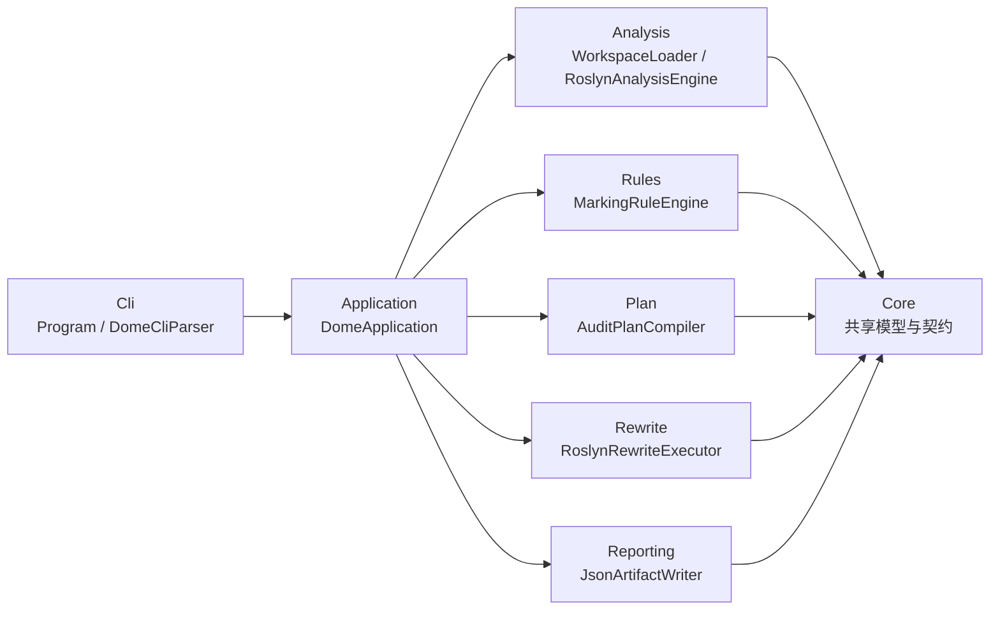

# Dome 架构总览

`dome` 是一个面向 C# 源码的静态分析与批量改写工具。它围绕一条固定主链路工作：

`CLI -> Application -> Analysis -> Rules -> Plan -> Rewrite -> Reporting`

工具支持三种运行模式：

- `RunMode.AnalyzeOnly`：只做加载、语义分析和分析结果输出。
- `RunMode.PlanOnly`：分析后生成 `audit-plan.json`，不改写源码。
- `RunMode.Standard`：执行完整流程，输出计划、报告和重写后的源码。

## 1. 设计目标

当前实现的设计重点不是“做最复杂的语义推理”，而是先稳定以下能力：

- 对 `.sln`、`.csproj`、目录、单文件四类输入建立统一入口。
- 把 Roslyn 分析结果整理成跨层可复用的 `AnalysisResultModel`、`AnalysisExecutionSnapshot`，并沿单一装配路径构造 `AnalysisServices` 和兼容 `AnalysisContext`。
- 通过规则系统把“命中目标”转成 `MarkDecision`。
- 将决策编译成顺序化、可序列化的 `AuditPlan`。
- 用 Roslyn 语法树把计划重新投射回源码，最终输出 JSON 产物与重写结果。

## 2. 总体分层

## 3. 每一层负责什么

| 层 | 目录 | 主要职责 | 代表 API |
| --- | --- | --- | --- |
| Cli | `src/Cli` | 解析命令行或配置文件，构造 `RunRequest` | `DomeCliParser.ParseAsync` |
| Application | `src/Application` | 组装依赖并调度全流程 | `DomeApplication.RunAsync` |
| Core | `src/Core` | 提供共享模型、枚举、图契约、报告契约 | `RunRequest`、`AnalysisResultModel`、`AuditPlan` |
| Analysis | `src/Analysis/Roslyn` | 加载输入、做 Roslyn 语义分析、构建查询服务与惰性图快照 | `RoslynAnalysisEngine.AnalyzeAsync` |
| Rules | `src/Rules` | 根据分析上下文生成标记决策 | `MarkingRuleEngine.Execute` |
| Plan | `src/Plan` | 把决策编译为无冲突、可执行的计划 | `AuditPlanCompiler.Compile` |
| Rewrite | `src/Rewrite/Roslyn` | 把 `AuditPlan` 投射回语法树并改写源码 | `RoslynRewriteExecutor.ExecuteAsync` |
| Reporting | `src/Reporting` | 将分析、计划、报告写成 JSON artifact | `JsonArtifactWriter` |

详细说明见：

- [执行流程](./execution-flow.md)
- [产物说明](./artifacts.md)
- [Core 层](./layers/core.md)
- [Cli 层](./layers/cli.md)
- [Application 层](./layers/application.md)
- [Analysis 层](./layers/analysis.md)
- [Rules 层](./layers/rules.md)
- [Plan 层](./layers/plan.md)
- [Rewrite 层](./layers/rewrite.md)
- [Reporting 层](./layers/reporting.md)

## 4. 依赖方向与边界

`dome` 当前遵循比较严格的单向依赖：

- `Cli` 只依赖 `Core`，负责把外部参数转成内部请求。
- `Application` 依赖其他所有执行层，但其他层不依赖 `Application`。
- `Analysis`、`Rules`、`Plan`、`Rewrite`、`Reporting` 都依赖 `Core` 契约。
- `Rules` 不直接改源码，只生成 `MarkDecision`。
- `Plan` 不理解 Roslyn 语法树，只处理目标、动作、冲突和执行顺序。
- `Rewrite` 不重新做语义分析，只消费已经编译好的 `AuditPlan`。

这种分层的直接收益是：

- 规则和计划逻辑可以在不触碰 Roslyn 改写代码的情况下迭代。
- JSON 产物可以复用 `Core` 契约序列化，不需要层间私有 DTO。
- `Application` 可以清晰区分“加载失败”“分析失败”“计划失败”“重写失败”。

## 5. 主执行通路

运行时的固定入口是 `src/Cli/Program.cs`：

1. `Program` 调用 `DomeCliParser.ParseAsync` 解析参数。
2. `Program` 通过 `DomeApplicationFactory.CreateDefault()` 组装默认实现。
3. `Program` 调用 `DomeApplication.RunAsync(request, cancellationToken)`。
4. `DomeApplication` 根据模式执行：
   - 加载输入
   - 分析
   - 规则决策
   - 计划编译
   - 可选重写
   - artifact 输出
5. `Program` 把 `FailureCode` 映射成进程退出码。

完整时序见 [execution-flow.md](./execution-flow.md)。

## 6. Analysis 子系统的关键设计

Analysis 是整个系统最重的一层，也是当前架构里最需要说清楚边界的一层。

### 6.1 输入模型统一为 `AnalysisInput`

分析引擎不再以“裸 `SourceDocument[]`”作为唯一中心，而是统一消费：

- `SourceOnlyAnalysisInput`
- `WorkspaceAnalysisContextInput`

其中 `WorkspaceAnalysisContextInput` 直接承载真实 Roslyn 语义对象：

- `Solution`
- `Project`
- `WorkspaceAnalysisDocumentContext`
  - `Document`
  - `SourceDocument`
  - `Compilation`
  - `SemanticModel`
  - `Root`

这意味着 `.sln` / `.csproj` 路径下的分析默认复用真实 workspace/project compilation，而不是退回“文本 + 极简 `CSharpCompilation`”。

### 6.2 默认不物化全量函数图

当前版本已经把函数分析收口到“全项目轻量索引 + 按需快照”：

- 默认产出：
  - `FunctionIndex`
  - `FunctionFactsIndex`
  - `TypeDependencyGraph`
  - statement facts / statement services
- 默认不产出：
  - 全量 `FunctionDependencyGraph`
  - 全量 `StatementDependencyGraph`

因此 `AnalysisResultModel` 里的状态被显式标注为：

- `StatementGraphMaterialization = SnapshotOnly`
- `FunctionGraphMaterialization = None`

`AnalysisResultModel.StatementGraph` 与 `AnalysisResultModel.FunctionGraph` 当前都只是兼容占位，不是规则传播的正式输入。

### 6.3 惰性函数图快照

函数图的正式入口是 `IFunctionGraphProvider.GetSnapshot(FunctionGraphRequest request)`。
当前 Analysis 层默认通过 `FunctionGraphRequests` 构造受支持的请求，而不是手工拼装任意 request。

兼容便捷入口 `GetWholeProjectSnapshot()` 与 `GetExpandedMembersSnapshot(...)` 仍可保留，但正式协议已经收口为请求对象：

- `Scope`
- `RootMemberIds`
- `Depth`
- `EdgeKinds`
- `Requester`
- `Reason`

当前实现约束：

- `WholeProject` 只物化 `Calls` 边。
- `ExpandedMembers(depth=1)` 使用双向 `Calls` 邻接扩张：
  - 向外看被 root 调用的方法
  - 向内看调用 root 的方法
- 扩张是“先按成员扩张，再按文件集合重建 snapshot”。
- 当前不做 snapshot 缓存，也不把 `Creates` / `ReadsMember` / `WritesMember` / `UsesPropertyAccessor` 纳入局部扩张。

## 7. Core 契约如何贯穿全流程

`src/Core/Models.cs` 是整个项目的公共语言层。最重要的契约可以按阶段理解：

- 入口与运行：
  - `RunRequest`
  - `RunResult`
  - `RunMode`
  - `FailureCode`
- 加载与分析输入：
  - `WorkspaceLoadOptions`
  - `WorkspaceLoadResult`
  - `AnalysisInput`
  - `WorkspaceAnalysisContextInput`
- 分析输出：
  - `AnalysisResultModel`
  - `AnalysisExecutionSnapshot`
  - `AnalysisServices`
  - `AnalysisTarget`
  - `AnalysisEdge`
  - `FunctionIndex`
  - `FunctionFactsIndex`
- 规则与计划：
  - `MarkDecision`
  - `PlanTarget`
  - `PlanAction`
  - `AuditPlan`
  - `PlanConflict`
- 报告与 summary：
  - `RunReport`
  - `RiskSummary`
  - `PlanCoverageSummary`
  - `FunctionImpactSummary`

换句话说，`Core` 决定了各层如何协作，而不是各层自行定义私有数据结构后再互相转换。

## 8. 当前代码库里的专题文档

- [experimental-cross-boundary-analysis.md](./experimental-cross-boundary-analysis.md) 是专题补充文档，不是主架构入口。
- 主入口应当从本文开始，再根据需要进入执行流程、各层说明和产物说明。
