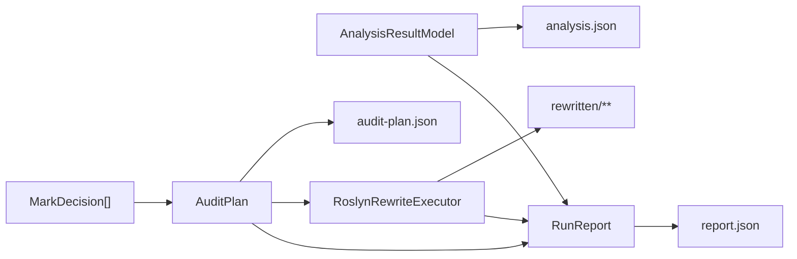

# Dome 输出产物说明

本文说明 `dome` 在不同模式下会生成哪些文件、这些文件由哪个层负责产生、主要字段表达什么。

相关文档：

- [架构总览](./architecture.md)
- [执行流程](./execution-flow.md)

## 1. 产物总表

| 产物 | 生成时机 | 直接写入者 | 上游来源 | 主要用途 |
| --- | --- | --- | --- | --- |
| `analysis.json` | `AnalyzeOnly` | `JsonArtifactWriter.WriteAnalysisAsync` | `AnalysisResultModel` | 导出分析结果，供人工检查或外部工具消费 |
| `audit-plan.json` | `PlanOnly`、`Standard` | `JsonArtifactWriter.WritePlanAsync` | `AuditPlan` | 导出计划变更、顺序与冲突 |
| `report.json` | 所有模式 | `JsonArtifactWriter.WriteReportAsync` | `RunReport` | 总结本次运行状态、产物、风险与失败信息 |
| `rewritten/**` | `Standard` | `DomeApplication` + `RoslynRewriteExecutor` | `AuditPlan` + 原源码 | 输出重写后的 C# 文件 |

## 2. 各模式会产生什么

| 模式 | 产物 |
| --- | --- |
| `AnalyzeOnly` | `analysis.json`、`report.json` |
| `PlanOnly` | `audit-plan.json`、`report.json` |
| `Standard` | `audit-plan.json`、`report.json`、`rewritten/**` |

## 3. `analysis.json`

`analysis.json` 是 `AnalysisResultModel` 的直接序列化结果。它由 Analysis 层提供数据，Reporting 层落盘。

### 3.1 主要内容

- `Targets`
- `Edges`
- `TypeGraph`
- `FunctionGraph`
- `StatementGraph`
- `StatementGraphMaterialization`
- `FunctionGraphMaterialization`

### 3.2 如何理解

#### `Targets`

每个 `AnalysisTarget` 描述一个可参与规则判定的目标，可能是：

- `TargetKind.Statement`
- `TargetKind.Method`
- `TargetKind.Class`

重要字段包括：

- `Target`
- `IsHighRisk`
- `Directives`
- `DefinesSymbols`
- `UsesSymbols`
- `InvokedMemberIds`
- `StatementKind`
- `IsSanitizingAssignment`
- `IsObjectInitializerAssignment`
- `HasMarkedExpressionSeed`
- `MarkedExpressionKinds`

#### `Edges`

当前 statement 分析边只表示：

- `Defines`
- `Uses`
- `Precedes`

它们用于构建 statement facts 和局部传播视图。

#### 图字段的当前语义

虽然 `analysis.json` 里仍保留：

- `FunctionGraph`
- `StatementGraph`

但当前版本需要结合物化状态一起理解：

- `FunctionGraphMaterialization = None`
- `StatementGraphMaterialization = SnapshotOnly`

也就是说：

- `FunctionGraph` 不是正式的默认全局函数图。
- `StatementGraph` 不是规则传播的正式全局输入。
- 正式入口分别是 `AnalysisServices.FunctionGraphs` 和 `AnalysisServices.Statements`。

## 4. `audit-plan.json`

`audit-plan.json` 是 `AuditPlan` 的序列化结果，表示“已经可执行”的计划，而不是原始规则命中。

### 4.1 主要内容

- `Metadata`
- `Changes`
- `Conflicts`

### 4.2 `Metadata`

记录本次计划的上下文，例如：

- 工具名和计划版本
- 输入路径
- 输出路径
- 运行模式
- 生成时间

### 4.3 `Changes`

每个 `PlannedChange` 都包含：

- `ExecutionOrder`
- `Target`
- `Action`
- `Reason`
- `Chain`

其中：

- `Target` 指明改哪一个 class / method / statement。
- `Action` 是 `Delete`、`CommentOut`、`ReplaceWithDefault`、`AddReturn` 之一。
- `Reason` 表示该变更来自哪条规则。
- `Chain` 用于记录数据流传播链路。

### 4.4 `Conflicts`

如果同一个 target 被编译出多个不兼容动作，`AuditPlanCompiler` 会输出 `PlanConflict`，并使计划编译失败。

常见含义：

- 同一 target 上同时出现多种 action。
- 当前没有 resolver 去自动裁决冲突。

## 5. `report.json`

`report.json` 是 Application 层对整次运行的总结，既覆盖成功结果，也覆盖失败信息。

### 5.1 主要内容

- `IsSuccess`
- `FailureCode`
- `AnalysisTargets`
- `PlannedChanges`
- `Conflicts`
- `RewrittenDocuments`
- `GeneratedArtifacts`
- `FailureSummary`
- `ConflictSummaries`
- `RiskSummary`
- `PlanCoverageSummary`
- `FunctionImpactSummary`
- `BoundaryPromotionSummary`
- `ReferenceZeroPredictionSummary`
- `WorkspaceLoadMode`
- `WorkspaceFallbackUsed`
- `WorkspaceDiagnostics`
- `Message`

### 5.2 为什么 `report.json` 很重要

它是最适合自动化系统消费的单一状态出口，因为它同时回答：

- 本次运行是否成功
- 失败在哪一层
- 生成了哪些文件
- 是否发生 fallback
- 是否存在风险目标或冲突
- 计划对 method / statement 的覆盖情况如何

## 6. `rewritten/**`

`rewritten/**` 只在 `RunMode.Standard` 下生成。

### 6.1 写入方式

`DomeApplication` 会逐个分析文档：

1. 从全局 `AuditPlan` 中筛出该文档对应的 `PlannedChange[]`。
2. 调用 `RoslynRewriteExecutor.ExecuteAsync`。
3. 按原始相对路径写到 `rewritten/<relative-path>`。

### 6.2 文件语义

- 这是“重写后的源码副本”，不会直接覆写输入源码。
- 目录结构跟随原始 `RelativePath`。
- 如果某个文档 rewrite 失败，流程会返回 `RewriteFailed` 并通过 `report.json` 说明原因。

## 7. 产物与层的映射

## 8. 使用建议

- 想看“工具看到了什么”，优先看 `analysis.json`。
- 想看“工具准备怎么改”，优先看 `audit-plan.json`。
- 想看“这次运行整体成败与摘要”，优先看 `report.json`。
- 想检查“改完后的源码是什么”，查看 `rewritten/**`。
