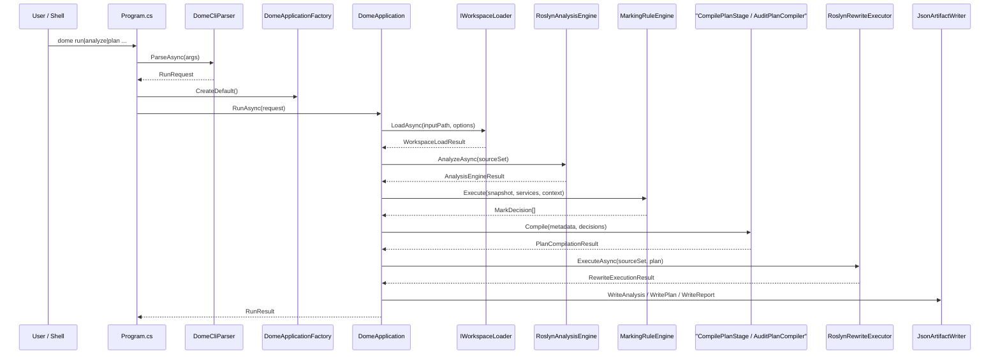

# Dome 执行流程

本文描述标准 `dome` CLI 从输入到 artifacts 的真实执行链路。

## 1. 时序

## 2. CLI 入口

`src/Cli/Program.cs`：

1. 解析命令行
2. 构造标准 `DomeApplication`
3. 调用 `RunAsync`
4. 根据 `FailureCode` 返回退出码

`DomeCliParser` 当前支持：

- `run <input> <output>`
- `analyze <input> <output>`
- `plan <input> <output>`
- `--config <path>`

旧 runtime 命令 `tr-run` / `tr-shadow` 已从标准 CLI 移除。

## 3. Application 流程阶段

当前标准 `Application` 主流程按阶段执行：

1. `WorkspaceLoadStage`
2. `AnalysisStage`
3. `AnalyzeOnlyFinalizeStage` 或继续
4. `MarkDecisionsStage`
5. `CompilePlanStage`
6. `PlanOnlyFinalizeStage` 或继续
7. `RewriteStage`
8. `StandardFinalizeStage`

这些阶段都位于 `src/Application/DomeApplicationStages.cs`。

## 4. Workspace 加载

标准加载入口是 `IWorkspaceLoader.LoadAsync(...)`。

默认实现由 `WorkspaceLoadCoordinator` 组合：

- `CodeAnalysisWorkspaceLoader`
- `SourceOnlyLoader`

策略：

- 目录或单 `.cs` 文件优先 `SourceOnly`
- `.sln` / `.csproj` 优先 `CodeAnalysis`
- 若允许 fallback，workspace 失败后回退到 `SourceOnly`

## 5. Analysis

标准分析入口是 `RoslynAnalysisEngine.AnalyzeAsync(SourceDocumentSet)`。

输出：

- `AnalysisResultModel`
- `AnalysisExecutionSnapshot`
- `AnalysisServices`
- `AnalysisPerformanceSummary`

分析结果既服务规则执行，也服务 artifact 输出。

## 6. Rules

`MarkingRuleEngine` 消费分析快照和查询服务，生成 `MarkDecision[]`。

默认 registry 包含：

- directive seed
- expression projection
- propagation
- protection
- method/class/member rules
- boundary promotion
- statement scope

## 7. Planning

计划编译由 `CompilePlanStage` 驱动，调用 `Model.Planning.AuditPlanCompiler.Compile(...)`。

它负责：

- 归一化删除决策
- 检测冲突
- 生成稳定执行顺序

输出：

- 成功：`PlanCompilationResult` + `AuditPlan`
- 失败：`PlanCompilationResult` + `PlanConflict[]`

## 8. Rewrite

只有 `RunMode.Standard` 进入 rewrite。

`DomeApplication` 会：

1. 把全局计划投影成文档级输入
2. 调用 `RoslynRewriteExecutor.ExecuteAsync`
3. 将结果写入 `rewritten/<relative-path>`

## 9. Reporting

标准 artifact 写入由 `JsonArtifactWriter` 负责：

- `analysis.json`
- `audit-plan.json`
- `report.json`

是否写哪些文件，由 `Application` 中的 artifact 策略决定。

## 10. 模式差异

| 模式 | 加载 | 分析 | 规则 | 计划 | 重写 | 输出 |
| --- | --- | --- | --- | --- | --- | --- |
| `AnalyzeOnly` | 是 | 是 | 否 | 否 | 否 | `analysis.json`、`report.json` |
| `PlanOnly` | 是 | 是 | 是 | 是 | 否 | `audit-plan.json`、`report.json` |
| `Standard` | 是 | 是 | 是 | 是 | 是 | `audit-plan.json`、`rewritten/**`、`report.json` |
