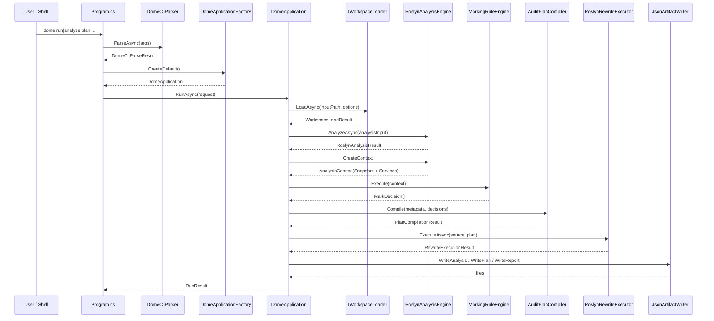

# Dome 执行流程

本文描述 `dome` 从 CLI 入口到输出 artifact 的真实执行链路，重点解释三种运行模式如何分叉。

返回总览见 [architecture.md](./architecture.md)。

## 1. 入口时序

## 2. 启动与依赖装配

### 2.1 CLI 入口

`src/Cli/Program.cs` 是唯一进程入口。它负责：

1. 调用 `DomeCliParser.ParseAsync`。
2. 解析失败时输出帮助文本或错误信息。
3. 通过 `DomeApplicationFactory.CreateDefault()` 创建默认实现。
4. 调用 `DomeApplication.RunAsync`。
5. 将 `FailureCode` 映射为退出码。

### 2.2 默认依赖图

`DomeApplicationFactory.CreateDefault()` 当前绑定的是：

- `WorkspaceLoadCoordinator`
  - `CodeAnalysisWorkspaceLoader`
  - `SourceWorkspaceLoader`
- `RoslynAnalysisEngine`
- `FunctionImpactAnalyzer`
- `ReferenceZeroPredictionAnalyzer`
- `MarkingRuleEngine(MarkingRuleRegistry.CreateDefault())`
- `RoslynRewriteExecutor`
- `JsonArtifactWriter`

这说明 `Application` 层本身不承载分析逻辑，它只是选择和组合具体实现。

## 3. Workspace 加载阶段

加载统一通过 `IWorkspaceLoader.LoadAsync(inputPath, options, cancellationToken)` 完成。

### 3.1 路径分发逻辑

`WorkspaceLoadCoordinator` 的分发规则是：

- 如果显式要求 `SourceOnly`，直接走 `SourceWorkspaceLoader`。
- 如果输入是目录或单个 `.cs` 文件，也直接走 `SourceWorkspaceLoader`。
- 如果输入是 `.sln` / `.csproj`，优先走 `CodeAnalysisWorkspaceLoader`。
- 若 `CodeAnalysis` 失败且允许回退，再回退到 `SourceWorkspaceLoader`。

### 3.2 两种加载结果

#### SourceOnly

`SourceWorkspaceLoader` 会把文件读取成 `SourceDocument[]`，再封装成：

- `SourceOnlyAnalysisInput`

适用场景：

- 目录扫描
- 单文件分析
- workspace 加载失败后的退化分析

#### CodeAnalysis

`CodeAnalysisWorkspaceLoader` 用 `MSBuildWorkspace` 打开 `.sln` 或 `.csproj`，并为每个 C# 文档构造：

- `WorkspaceDocumentContext`
  - `Document`
  - `SourceDocument`
  - `Compilation`
  - `SemanticModel`
  - `Root`

再统一封装成 `WorkspaceAnalysisInput`。

这样做的核心意义是：

- 项目引用、条件编译、metadata references 由真实 Roslyn workspace 提供。
- 后续分析直接消费这些语义上下文，而不是重复解析或重新构造简化 compilation。

## 4. Analysis 子流程

`DomeApplication` 得到 `WorkspaceLoadResult` 后，会把 `AnalysisInput` 交给 `RoslynAnalysisEngine.AnalyzeAsync`。

### 4.1 `RoslynAnalysisEngine` 产出什么

当前分析引擎主要产出四类结果：

- `AnalysisView`
- `RoslynAnalysisDocument[]`
- `FunctionIndex`
- `FunctionFactsIndex`

其中：

- `AnalysisView` 面向 artifact 输出和规则输入。
- `RoslynAnalysisDocument` 保存文档、语法树、`SemanticModel` 和目标列表，供后续上下文构建与改写定位使用。
- `FunctionIndex` / `FunctionFactsIndex` 面向函数级查询和快照构建。

### 4.2 每个文档上做的事情

分析每个文档时，主要步骤是：

1. 读取 `CompilationUnitSyntax` 与 `SemanticModel`。
2. 扫描类型声明并构建 `TypeDependencyGraph` 节点和边。
3. 扫描方法、构造函数、访问器并建立 `FunctionNodeRef`。
4. 提取 statement / initializer / class 级 `AnalysisTarget`。
5. 为 `AnalysisTarget` 记录：
   - `PlanTarget`
   - directives
   - defines / uses symbols
   - invoked member ids
   - statement kind
   - high-risk / sanitizing / object-initializer 等标记
6. 生成 statement 级 `AnalysisEdge`：
   - `Defines`
   - `Uses`
   - `Precedes`

### 4.3 当前函数图策略

当前版本默认不在 `AnalysisView` 中放全量函数图，而是分两层：

- 全项目轻量索引：
  - `FunctionIndex`
  - `FunctionFactsIndex`
- 按需快照：
  - `IFunctionGraphProvider.GetWholeProjectSnapshot()`
  - `IFunctionGraphProvider.GetExpandedMembersSnapshot(...)`

因此：

- `AnalysisView.FunctionGraphMaterialization = None`
- `AnalysisView.StatementGraphMaterialization = SnapshotOnly`

### 4.4 snapshot / services 阶段

`RoslynAnalysisEngine` 当前会先围绕单一 `AnalysisSnapshot` 组装正式模型：

- `AnalysisSnapshot`
  - `AnalysisView`
  - `FunctionIndex`
  - `FunctionFactsIndex`
  - `StatementFactsIndex`
- `AnalysisServices`
  - `IInheritanceQueryService`
  - `IReferenceQueryService`
  - `IStatementAnalysisService`
  - `IFunctionGraphProvider`

`AnalysisContext` 仍保留，但它现在是兼容 facade，用来组合上述两层并服务旧调用点。

## 5. Rules 阶段

`MarkingRuleEngine.Execute(context)` 负责把分析上下文转换成 `MarkDecision[]`。

当前默认 registry 里的规则类型包括：

- Seed rules
- Expression projection rules
- Propagation rules
- Protection rules
- Method rules
- Class rules
- Boundary promotion rules
- Statement scope rules

执行顺序大致是：

1. 先对 statement/class target 生成种子决策。
2. 对命中的 statement 进行局部 statement snapshot 分析，并做数据流传播。
3. 执行 boundary promotion，把 statement delete 提升到 method delete。
4. 如果当前是完整上下文执行，再跑 method/class 级规则。

## 6. Plan 阶段

`AuditPlanCompiler.Compile(metadata, decisions)` 把 `MarkDecision[]` 编译成 `AuditPlan`。

它会做三件事：

1. 归一化删除决策，去掉被 class delete / method delete 覆盖的低层 target。
2. 检测同一个 target 是否出现多动作冲突。
3. 为最终变化建立确定性的执行顺序。

输出：

- 成功：`PlanCompilationResult.Success(AuditPlan plan)`
- 失败：`PlanCompilationResult.Failure(...)`

## 7. Rewrite 阶段

只有 `RunMode.Standard` 才会进入 rewrite。

`DomeApplication` 会按分析文档逐个拆分文档级 plan：

1. 过滤出当前文档对应的 `PlannedChange[]`。
2. 调用 `RoslynRewriteExecutor.ExecuteAsync(source, documentPlan, cancellationToken)`。
3. 把结果写到 `output/rewritten/<relative-path>`。

`RoslynRewriteExecutor` 的内部流程是：

1. 解析源码为语法树。
2. 按 document/member/span/order 排序 change。
3. 用 `PlanTarget` 在语法树里定位 class/method/statement 节点。
4. 应用动作：
   - `Delete`
   - `CommentOut`
   - `ReplaceWithDefault`
   - `AddReturn`
5. 输出 `NormalizeWhitespace()` 后的源码。

## 8. Reporting 阶段

Reporting 由 `JsonArtifactWriter` 负责，Application 决定什么时候写哪些文件。

### 8.1 `AnalyzeOnly`

写出：

- `analysis.json`
- `report.json`

### 8.2 `PlanOnly`

写出：

- `audit-plan.json`
- `report.json`

### 8.3 `Standard`

写出：

- `audit-plan.json`
- `rewritten/**`
- `report.json`

当前标准模式不会额外持久化 `analysis.json`，除非调用方自行扩展 `DomeApplication`。

## 9. 失败路径

`DomeApplication` 明确区分几类失败：

- `WorkspaceLoadFailed`
- `AnalysisFailed`
- `PlanCompileFailed`
- `RewriteFailed`
- `ReportFailed`

失败时仍尽量写出 `report.json`，让调用方知道流程停在哪一层。

## 10. 模式差异总结

| 模式 | 加载 | 分析 | 规则 | 计划 | 重写 | 输出 |
| --- | --- | --- | --- | --- | --- | --- |
| `AnalyzeOnly` | 是 | 是 | 否 | 否 | 否 | `analysis.json`、`report.json` |
| `PlanOnly` | 是 | 是 | 是 | 是 | 否 | `audit-plan.json`、`report.json` |
| `Standard` | 是 | 是 | 是 | 是 | 是 | `audit-plan.json`、`rewritten/**`、`report.json` |
