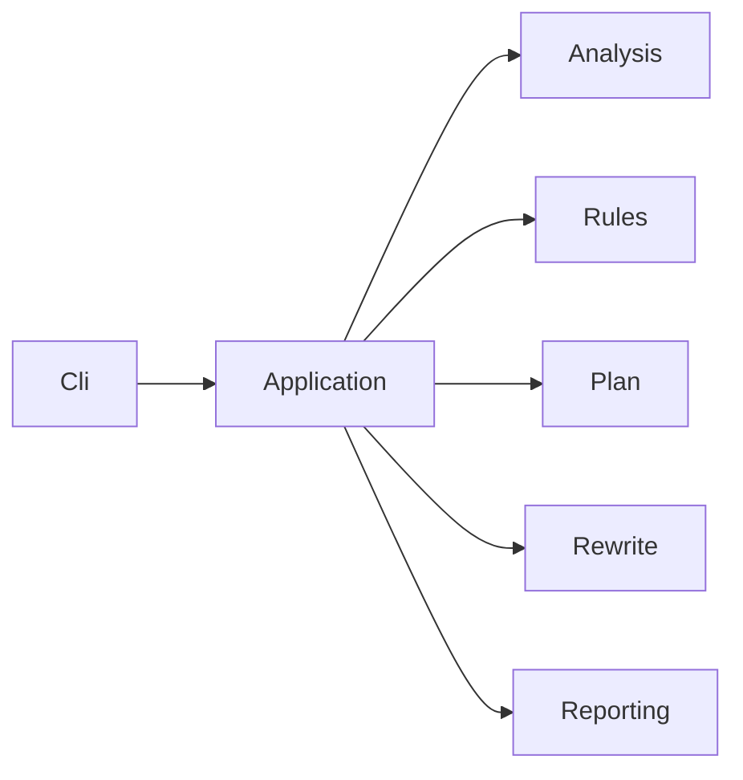

# Application 层说明

返回 [架构总览](../architecture.md)。

## 1. 这一层做什么

`src/Application` 是 `dome` 的编排层。它知道完整流程怎么跑，但不在本层内实现具体分析、规则或改写算法。

Application 层的核心目标是：

- 组装默认实现
- 控制执行顺序
- 根据不同 `RunMode` 选择流程分支
- 在失败时产生统一的 `RunResult` 和 `RunReport`

## 2. 主要输入 / 输出

### 输入

- `RunRequest`
- 各执行层的服务实例

### 输出

- `RunResult`
- `report.json`
- 视模式而定的其他 artifact

## 3. 对外 API

| API | 作用 | 调用方 |
| --- | --- | --- |
| `DomeApplicationFactory.CreateDefault()` | 组装默认依赖图 | `Program` |
| `DomeApplication.RunAsync(request, cancellationToken)` | 执行一次完整运行 | `Program` 或外部宿主 |

## 4. 关键协作对象

`DomeApplication` 当前直接协作的对象包括：

- `IWorkspaceLoader`
- `RoslynAnalysisEngine`
- `FunctionImpactAnalyzer`
- `ReferenceZeroPredictionAnalyzer`
- `MarkingRuleEngine`
- `RoslynRewriteExecutor`
- `JsonArtifactWriter`

这说明 Application 层处在“所有执行服务的上游”，但不承担这些服务内部逻辑。

## 5. 这一层承担的职责

### 5.1 统一主流程

`RunAsync` 统一调度：

1. Load
2. Analyze
3. Create context
4. Execute rules
5. Compile plan
6. Optional rewrite
7. Write artifacts

### 5.2 模式分支控制

Application 层是三种模式的分叉点：

- `AnalyzeOnly`
- `PlanOnly`
- `Standard`

### 5.3 统一错误语义

所有阶段失败都会在这里转换成：

- `FailureCode`
- `RunResult`
- `RunReport`

### 5.4 统一 summary 构建

以下 summary 目前都在 `DomeApplication` 内汇总：

- `RiskSummary`
- `PlanCoverageSummary`
- `FunctionImpactSummary`
- `BoundaryPromotionSummary`
- `ReferenceZeroPredictionSummary`

## 6. 在主执行流程中的位置

它是流程调度中心，而不是业务规则中心。

## 7. 与上下游层的边界

### 上游

- `Cli`
- 外部调用方

### 下游

- Analysis
- Rules
- Plan
- Rewrite
- Reporting

Application 层可以决定“何时调用某层”，但不应把某层内部逻辑搬进来。

## 8. 本层不负责什么

Application 层不负责：

- 解析命令行文本
- 直接构造 Roslyn 语义模型
- 判断规则命中细节
- 冲突裁决算法
- 具体语法树编辑细节
- JSON 序列化格式定义
