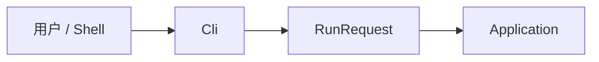

# Cli 层说明

返回 [架构总览](../architecture.md)。

## 1. 这一层做什么

`src/Cli` 是 `dome` 的进程入口层。它的职责不是执行业务，而是把外部调用形式转换成内部的 `RunRequest`。

当前支持两类输入方式：

- 直接命令行参数
- `--config <path>` 指向的 JSON 配置文件

## 2. 主要输入 / 输出

### 输入

- `string[] args`
- 配置文件 JSON

### 输出

- `DomeCliCommandParseResult`
  - 成功时包含 `RunRequest`
  - 失败时包含错误信息或帮助文本

## 3. 对外 API

| API | 作用 | 输入 | 输出 |
| --- | --- | --- | --- |
| `DomeCliParser.ParseAsync` | 解析命令行或配置文件 | `string[] args` | `DomeCliCommandParseResult` |
| `DomeCliParser.UsageText` | CLI 帮助文本 | 无 | `string` |
| `DomeCliRunConfiguration` | 配置文件反序列化结构 | JSON | 配置对象 |
| `DomeCliCommandParseResult` | 解析结果封装 | 无 | `IsSuccess` / `Request` / `ErrorMessage` |

## 4. 这层承担的职责

Cli 层目前承担以下责任：

- 识别命令：
  - `run`
  - `analyze`
  - `plan`
- 把命令映射成 `RunMode`
- 解析 workspace loader 选项：
  - `--loader`
  - `--no-fallback`
- 从配置文件中构造 `RunRequest`
- 在程序失败时输出帮助或错误信息

## 5. 在主执行流程中的位置

它是唯一直接面对用户输入格式的一层。

## 6. 与上下游层的边界

### 上游

- Shell / 用户命令
- 配置文件

### 下游

- `Application` 层
- `Core.RunRequest`

Cli 层不会自己实例化分析器或规则引擎，它只负责准备参数和调用应用层。

## 7. 本层不负责什么

Cli 层不负责：

- 加载源码或 workspace
- 分析 C# 语义
- 生成 `AnalysisResultModel`
- 执行规则
- 编译计划
- 重写源码
- 写 JSON artifact
