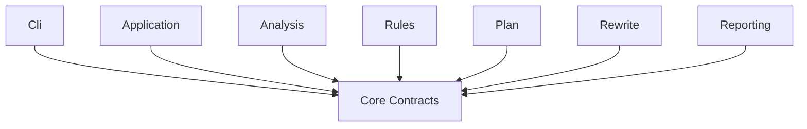

# Core 层说明

返回 [架构总览](../architecture.md)。

## 1. 这一层做什么

`src/Core` 是整个 `dome` 的共享契约层。它不负责执行分析、规则、改写或输出，但定义了这些层之间交换数据时共同使用的类型。

Core 层的目标是：

- 让每一层用同一套模型表达输入、分析结果、计划和报告。
- 避免层与层之间通过私有 DTO 或匿名结构耦合。
- 让 artifact 序列化和测试断言直接复用正式契约。

## 2. 主要输入 / 输出

Core 本身没有运行期“输入输出文件”，它输出的是可复用的类型系统：

- 输入侧模型：`RunRequest`、`AnalysisInput`
- 分析侧模型：`AnalysisView`、`AnalysisTarget`
- 规则侧模型：`MarkDecision`
- 计划侧模型：`AuditPlan`、`PlanConflict`
- 输出侧模型：`RunReport`

## 3. 对外 API / 核心契约

| 类型 / 契约 | 作用 | 主要调用方 |
| --- | --- | --- |
| `RunRequest` | 表示一次 CLI/Application 运行请求 | `Cli`、`Application` |
| `RunResult` | 表示一次运行的最终成败 | `Application`、`Cli` |
| `AnalysisInput` / `SourceOnlyAnalysisInput` / `WorkspaceAnalysisInput` | 统一分析输入抽象 | `WorkspaceLoader`、`RoslynAnalysisEngine` |
| `WorkspaceLoadResult` | 表示输入加载结果与诊断 | `Analysis`、`Application` |
| `AnalysisView` | 静态分析的正式输出视图 | `Analysis`、`Rules`、`Reporting` |
| `FunctionIndex` / `FunctionFactsIndex` | 函数索引与函数事实 | `Analysis`、`Rules`、`Application` |
| `IFunctionGraphProvider` | 惰性函数图快照入口 | `Analysis`、`Application` |
| `IStatementAnalysisService` | 局部 statement snapshot 分析入口 | `Analysis`、`Rules` |
| `MarkDecision` | 规则引擎的判定结果 | `Rules`、`Plan` |
| `AuditPlan` | 可执行改写计划 | `Plan`、`Rewrite`、`Reporting` |
| `RewriteExecutionResult` | 改写执行结果 | `Rewrite`、`Application` |
| `RunReport` | 运行摘要、失败信息、summary 集合 | `Application`、`Reporting` |

## 4. 这一层承担的职责

### 4.1 统一阶段边界

通过共享模型把流程切成清晰阶段：

- 入口：`RunRequest`
- 分析：`AnalysisView`
- 决策：`MarkDecision`
- 计划：`AuditPlan`
- 落地与汇报：`RunReport`

### 4.2 统一标识体系

Core 为 type、member、target、graph edge 提供了统一结构，例如：

- `MemberId`
- `PlanTarget`
- `TypeNodeRef`
- `FunctionNodeRef`
- `AnalysisEdge`

这保证了不同层引用的是同一个对象身份概念。

### 4.3 统一运行状态表达

Core 定义了多组状态枚举，用于表达同一条运行链上的不同阶段：

- `RunMode`
- `FailureCode`
- `WorkspaceLoadMode`
- `PlanActionKind`
- `StatementGraphMaterialization`
- `FunctionGraphMaterialization`

### 4.4 统一 summary 与 artifact schema

`RunReport` 及其 summary 类型决定了 `report.json` 的结构，而不是由 Reporting 层单独拼装。

## 5. 在主流程中的位置

Core 不在主流程“前面”或“后面”，而是整个流程的共同地基。

## 6. 本层不负责什么

Core 不负责：

- 读取命令行参数
- 加载 Roslyn workspace
- 做语义分析
- 执行规则推理
- 应用源码改写
- 直接写入 JSON 文件

如果一个类型开始携带大量 Roslyn 节点操作或 IO 逻辑，就说明它不该留在 Core 层。
