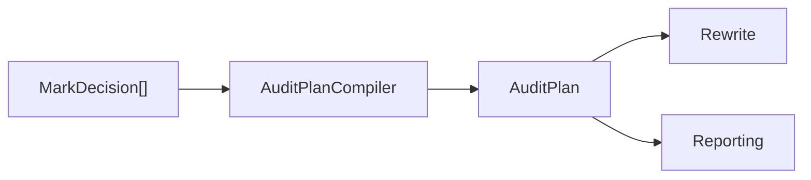

# Plan 层说明

返回 [架构总览](../architecture.md)。

## 1. 这一层做什么

`src/Plan` 负责把 Rules 层输出的 `MarkDecision[]` 编译成可执行的 `AuditPlan`。

它的定位不是“继续推理”，而是把已经产生的决策做结构化收口：

- 去掉被上层删除覆盖的低层 target
- 检测冲突
- 建立稳定执行顺序

## 2. 主要输入 / 输出

### 输入

- `PlanMetadata`
- `IEnumerable<MarkDecision>`

### 输出

- `PlanCompilationResult`
  - 成功时包含 `AuditPlan`
  - 失败时包含 `PlanConflict[]`

## 3. 对外 API

| API | 作用 | 调用方 |
| --- | --- | --- |
| `AuditPlanCompiler.Compile(metadata, decisions)` | 编译审计计划 | `Application` |

## 4. 这一层承担的职责

### 4.1 规范化删除决策

当前编译器会消解两类覆盖关系：

- `Class Delete` 覆盖其下 method / statement target
- `Method Delete` 覆盖同一 method 内的 statement delete

### 4.2 检测冲突

如果同一 `PlanTarget` 上出现多个不同 `PlanActionKind`，当前会直接认定为冲突，而不是尝试自动裁决。

### 4.3 排序变更

成功编译后，`PlannedChange` 会按稳定顺序输出，便于：

- rewrite 逐项应用
- artifact 可重复比较
- 测试做确定性断言

## 5. 在主执行流程中的位置

Plan 层处在“规则判定”和“源码改写”之间。

## 6. 与上下游层的边界

### 上游

- Rules 层

### 下游

- Rewrite 层
- Reporting 层
- Application 层中的 summary 汇总

Plan 层不应依赖 Roslyn 语法节点，只应依赖 `Core` 契约。

## 7. 本层不负责什么

Plan 层不负责：

- 重新跑规则
- 重新分析引用关系
- 直接改写源码
- 写 JSON 文件
