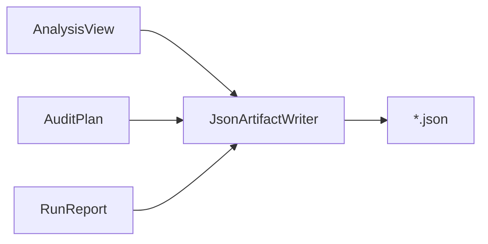

# Reporting 层说明

返回 [架构总览](../architecture.md)。

## 1. 这一层做什么

`src/Reporting` 负责把正式契约对象序列化成 JSON 文件。

它是最薄的一层，专注于“怎么写出 artifact”，而不负责“artifact 里应该包含什么业务语义”。

## 2. 主要输入 / 输出

### 输入

- `AnalysisView`
- `AuditPlan`
- `RunReport`

### 输出

- `analysis.json`
- `audit-plan.json`
- `report.json`

## 3. 对外 API

| API | 作用 | 调用方 |
| --- | --- | --- |
| `JsonArtifactWriter.WriteAnalysisAsync` | 写 `analysis.json` | `Application` |
| `JsonArtifactWriter.WritePlanAsync` | 写 `audit-plan.json` | `Application` |
| `JsonArtifactWriter.WriteReportAsync` | 写 `report.json` | `Application` |

## 4. 这一层承担的职责

### 4.1 统一 JSON 序列化选项

当前统一启用：

- 缩进输出
- enum 按字符串序列化

这保证 artifact：

- 可读
- 对 diff 友好
- 更适合人工检查

### 4.2 只做写盘，不做业务组装

Reporting 层默认假设上游已经准备好正确的模型对象。它不会：

- 自己计算风险 summary
- 自己拼 plan conflict
- 自己筛 mode 对应的业务内容

这些职责都应由 Application 或上游执行层完成。

## 5. 在主执行流程中的位置

## 6. 与上下游层的边界

### 上游

- Application
- Core 契约对象

### 下游

- 文件系统中的 JSON artifact

Reporting 层不应该反向依赖 Analysis、Rules、Plan 的内部实现细节。

## 7. 本层不负责什么

Reporting 层不负责：

- 加载输入
- 语义分析
- 规则执行
- 计划编译
- 代码重写
