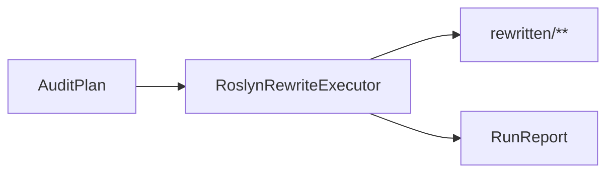

# Rewrite 层说明

返回 [架构总览](../architecture.md)。

## 1. 这一层做什么

`src/Rewrite/Roslyn` 负责将 `AuditPlan` 中的变更应用回 C# 语法树，生成重写后的源码文本。

Rewrite 层处理的是“怎么改”，而不是“该不该改”。

## 2. 主要输入 / 输出

### 输入

- 原始源码字符串
- `AuditPlan`

### 输出

- `RewriteExecutionResult`
  - 成功时包含 `RewrittenSource`
  - 失败时包含错误消息

## 3. 对外 API

| API | 作用 | 调用方 |
| --- | --- | --- |
| `RoslynRewriteExecutor.ExecuteAsync(source, plan, cancellationToken)` | 执行一次源码重写 | `Application` |

## 4. 这一层承担的职责

### 4.1 用 `PlanTarget` 重新定位语法节点

Rewrite 层使用多重信息来定位目标：

- `DocumentPath + MemberId`
- `SpanStart + SpanLength`
- `DisplayText`

这样做是为了降低仅靠 span 或仅靠名字定位带来的歧义。

### 4.2 按目标类型应用动作

当前支持三种 target：

- `TargetKind.Statement`
- `TargetKind.Method`
- `TargetKind.Class`

当前支持的 action：

- `Delete`
- `CommentOut`
- `ReplaceWithDefault`
- `AddReturn`

### 4.3 生成可写回的源码文本

所有 change 应用完后，Rewrite 层输出经过 `NormalizeWhitespace()` 的文本，交由 Application 写入 `rewritten/**`。

## 5. 动作与 target 的关系

| TargetKind | 支持动作 |
| --- | --- |
| `Statement` | `Delete`、`CommentOut`、`ReplaceWithDefault`、`AddReturn` |
| `Method` | `Delete`、`AddReturn` |
| `Class` | `Delete` |

如果 action 与 target 不匹配，Rewrite 层会返回失败。

## 6. 在主执行流程中的位置

Rewrite 只在 `RunMode.Standard` 下运行：

## 7. 与上下游层的边界

### 上游

- `Application`
- `Plan`

### 下游

- `Application` 负责最终写文件

Rewrite 层只产出重写文本，不决定输出目录结构，也不直接写 `audit-plan.json` / `report.json`。

## 8. 本层不负责什么

Rewrite 层不负责：

- 判断 target 是否应该被删除
- 重新做语义分析
- 合并冲突
- 写 JSON artifact
